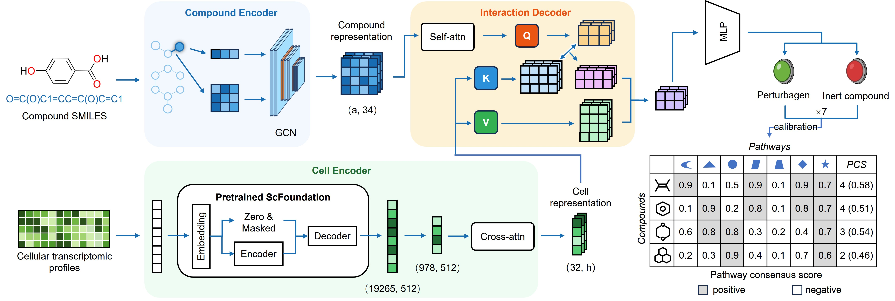

# PathoScreen
PathoScreen was designed for predicting **small-molecule perturbation capability on MASLD-specific pathways** as a **binary classification** task.

## Framework
 

## Installation
Create the conda environment:
```bash
conda env create -f environment.yaml
conda activate pathoscreen
```

## Quick start

## 1. Build SMILES cache
Build a global RDKit-based molecular graph cache from all pathway CSVs.
```bash
python scripts/build_smiles_cache.py \
  --pathways_root data/pathways \
  --out_dir data/cache \
  --cache_name smiles_graph_cache_v1.pkl \
  --isomeric 1
```

## 2. Train models (per pathway)
Each MASLD-specific pathway is trained independently (`pathway_id = 0–6`).
```bash
python train.py --pathway_id 0 --config ./configs/train_template.yaml
```

## 3. Inference
Predict perturbation probability of small-molecule on MASLD-specific pathways:
```bash
python predict.py \
  --pathway_id 0 \
  --input_csv [path/to/your_candidates.csv] \
  --emb_pkl ./data/cell_emb/FFA_emb.npy \
  --output_csv output/P0/P0_pred.csv
```
Each output file contains pathway-specific scores and labels.

## 4. Calibration & Brier scores
Train isotonic calibrators and compute pathway-level Brier scores.
```bash
python scripts/train_calibrator.py \
  --pathway_ids 0 1 2 3 4 5 6 \
  --test_data_root data/pathways \
  --emb_path data/cell_matrix/input_cell_matrix.pkl \
  --output_dir output/P0/calibration_results
```

## 5. Rank candidates
Aggregate predictions across pathways and rank candidates.
```bash
python scripts.rank_candidates.py \
  --pred_dir output \
  --brier_json calibration_results/brier_scores.json \
  --output_file output/final_rank.csv
```

Ranking strategy:
1. **Vote count**: number of pathways predicted positive
2. **PCS**: Brier-weighted consensus score

Final ranking is sorted by `Vote_Count` → `PCS` (descending).
---

## Pathway mapping

Seven MASLD-related pathways are indexed as `P0–P6` and defined in `src/config.py`.

---


